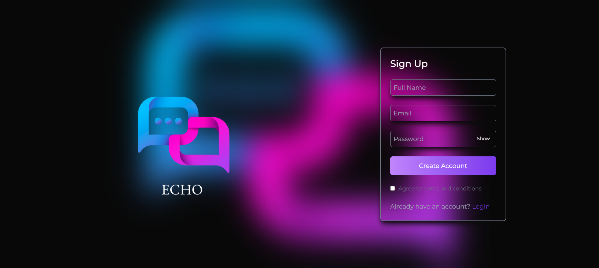
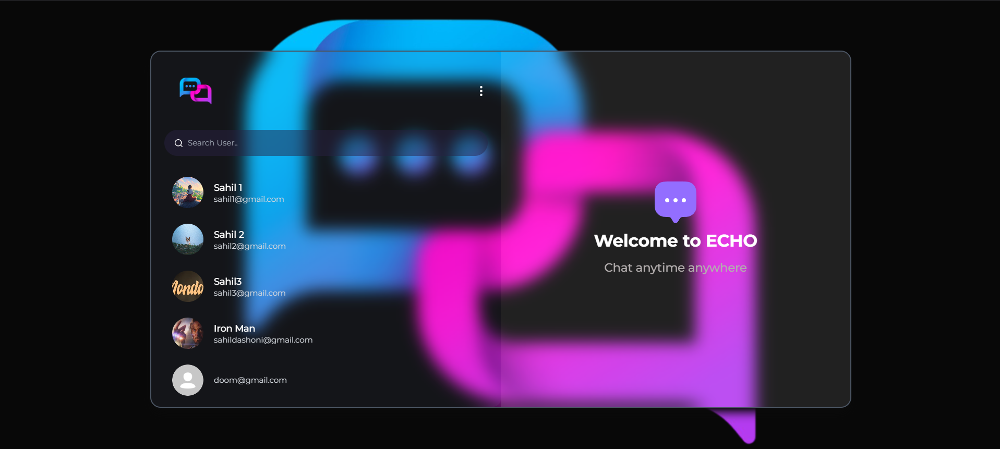
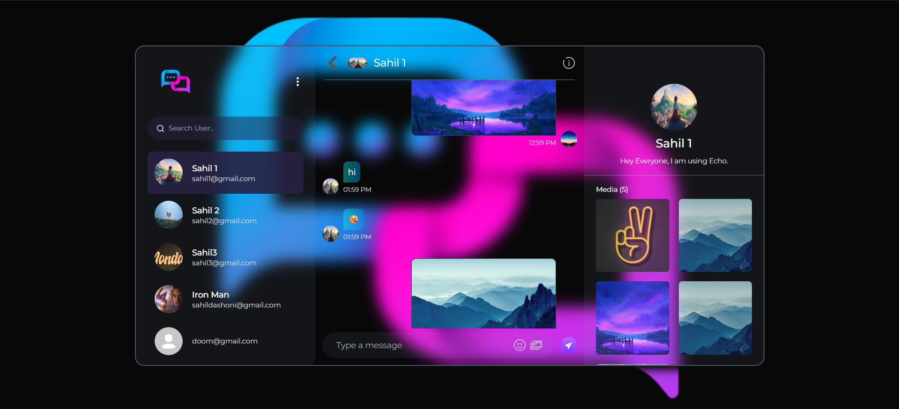
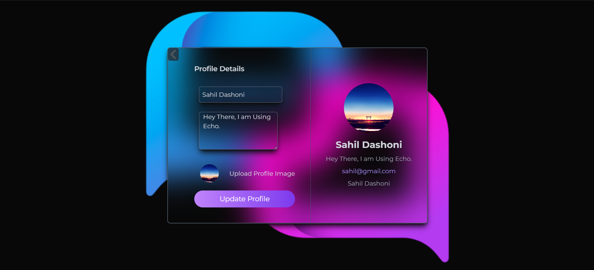

# 💬 Echo – Glassmorphism Real-Time Chat Application

Echo is a modern **MERN Stack** real-time chat application built with **React, Node.js, Express, MongoDB, and Socket.IO**. It features instant one-to-one messaging, secure authentication, image sharing, profile management, and a sleek **Glassmorphism-inspired UI** with a neon purple-blue theme for an engaging messaging experience.

---

## 📸 Preview

### Login / Signup



---

### Welcome Screen



---

### Real-Time Chat



---

### Profile Management



---

## ✨ Features

### 💬 Real-Time Messaging
- Instant one-to-one messaging using **Socket.IO**
- Live message delivery
- Typing-ready architecture
- Online/offline user status

### 🔐 Authentication
- JWT Authentication
- Password hashing with **bcrypt**
- Secure login and registration
- Protected routes

### 👤 User Profiles
- Update profile information
- Upload profile pictures
- Personalized user bio
- View contact information

### 🖼 Media Sharing
- Send image messages
- View shared media inside conversation
- Cloud image storage support

### 🔍 Chat Management
- Search users
- Conversation list
- Responsive chat interface

### 🎨 Modern UI
- Beautiful **Glassmorphism** design
- Neon blue & purple gradient theme
- Responsive layout
- Smooth user experience

### ⚡ State Management
- Redux Toolkit
- Centralized global state
- Optimized rendering

---

# 🛠 Tech Stack

## Frontend
- React.js
- Redux Toolkit
- React Router
- Axios
- CSS3

## Backend
- Node.js
- Express.js

## Database
- MongoDB Atlas

## Real-Time Communication
- Socket.IO

## Authentication
- JWT
- bcrypt.js

## Image Uploads
- Multer
- Cloudinary

---

# 📂 Project Structure

```text
Echo
│
├── client/
│   ├── src/
│   ├── public/
│
├── server/
│   ├── controllers/
│   ├── middleware/
│   ├── models/
│   ├── routes/
│   ├── utils/
│   └── socket/
│
└── README.md
```

---

# 🚀 Installation

## Clone Repository

```bash
git clone https://github.com/Sahil-Dashoni/Echo.git

cd Echo
```

---

## Install Dependencies

### Backend

```bash
cd server
npm install
```

### Frontend

```bash
cd client
npm install
```

---

# ⚙ Environment Variables

Create a **.env** file inside the **server** directory.

```env
PORT=5000

MONGO_URI=your_mongodb_connection_string

JWT_SECRET=your_jwt_secret

CLIENT_URL=http://localhost:3000

CLOUDINARY_CLOUD_NAME=your_cloud_name

CLOUDINARY_API_KEY=your_api_key

CLOUDINARY_API_SECRET=your_api_secret
```

---

# ▶ Running the Application

### Backend

```bash
cd server
npm start
```

### Frontend

```bash
cd client
npm start
```

---

# 🚀 Technologies Used

- React.js
- Redux Toolkit
- Node.js
- Express.js
- MongoDB Atlas
- Socket.IO
- JWT Authentication
- bcrypt.js
- Multer
- Cloudinary

---

# 🌟 Highlights

- ⚡ Real-Time Communication using Socket.IO
- 🎨 Modern Glassmorphism UI
- 🔐 Secure JWT Authentication
- 🖼 Image Sharing Support
- 👤 Profile Management
- 📱 Fully Responsive Design
- 🚀 MERN Stack Architecture

---

# 🔮 Future Enhancements

- Group Chats
- Message Reactions
- Voice Messages
- Video Calling
- Read Receipts
- Push Notifications
- End-to-End Encryption
- AI Chat Assistant

---

# 👨‍💻 Author

**Sahil Dashoni**

GitHub: https://github.com/Sahil-Dashoni

---

# 📄 License

This project is intended for educational and learning purposes. Feel free to fork, learn from, and contribute.
